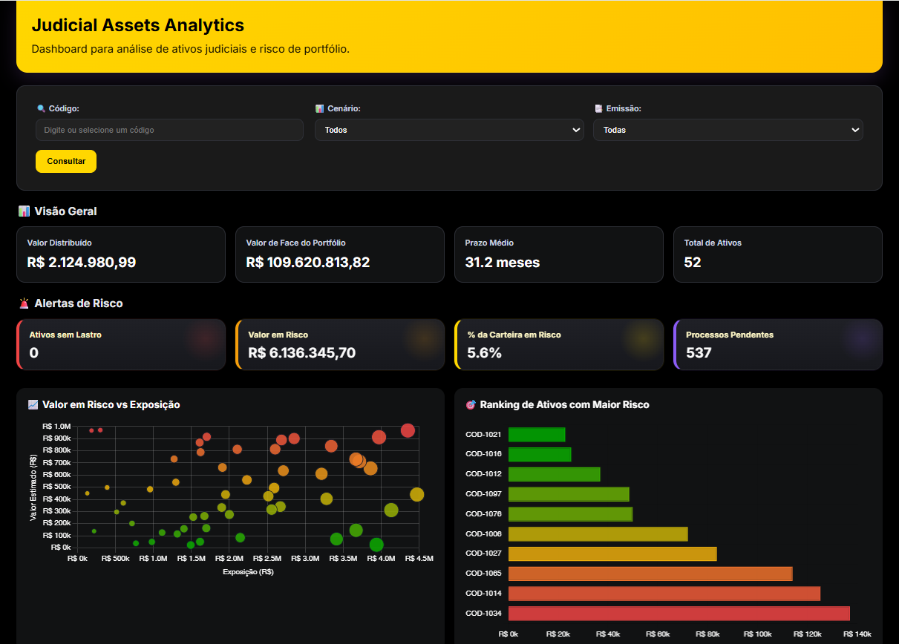
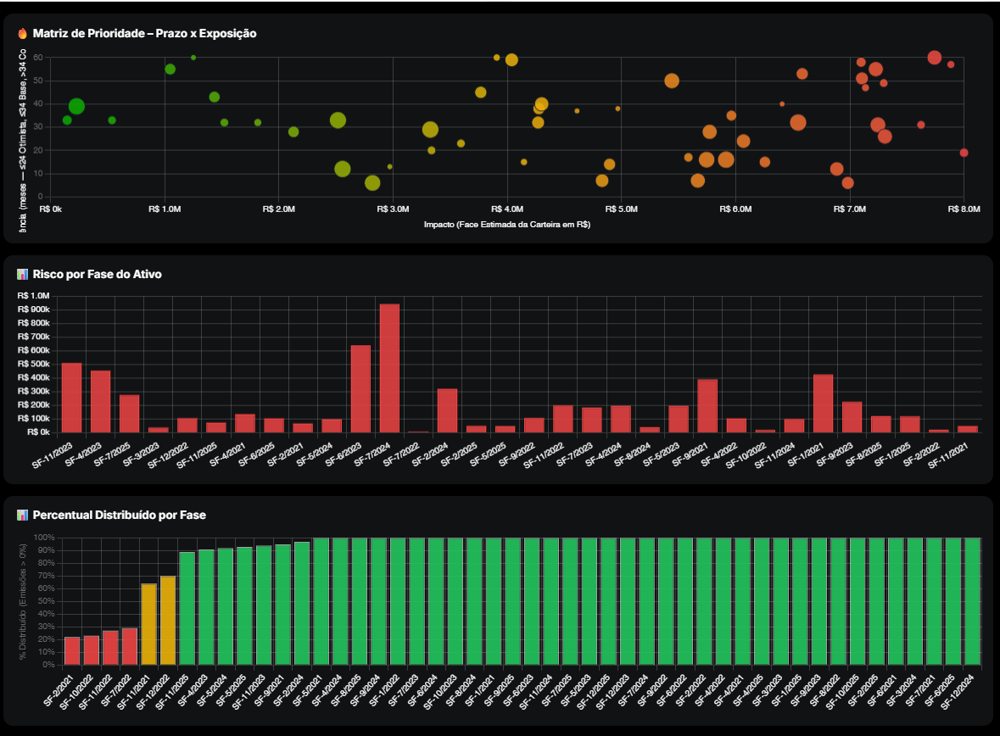
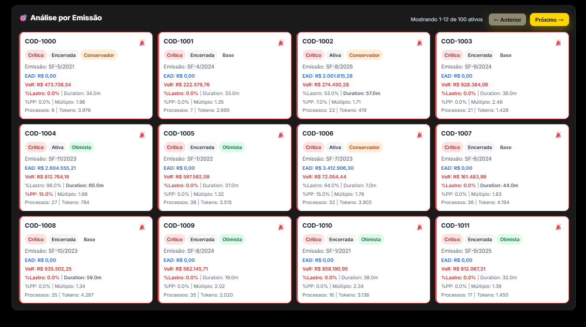

# 📊 Judicial Assets Analytics

Dashboard interativo para análise de **ativos judiciais**, focado em
**risco, lastro, exposição financeira e performance da carteira**.

## 🎯 Objetivo
Demonstrar como dados financeiros e jurídicos podem ser transformados
em **indicadores claros de risco e valor**, apoiando decisões estratégicas
em contextos de investimento estruturado.

## 🧠 Principais KPIs
- **Valor Distribuído** — montante efetivamente pago aos investidores
- **Valor de Face do Portfólio** — soma bruta dos valores nominais dos ativos
- **Valor Real (Lastreado)** — valor protegido por lastro jurídico
- **% da Carteira em Risco** — exposição sem cobertura de lastro
- **Prazo Médio Ponderado** — duração média considerando participação

## 🏗️ Arquitetura
- **Backend**: Python + Flask
- **Processamento**: Pandas / NumPy
- **Frontend**: HTML + CSS + JavaScript (Chart.js)
- **Fonte de dados**: planilha Excel (dados fictícios)

## 🔐 Observação Importante
Todos os dados utilizados neste projeto são **100% fictícios** e foram
criadas exclusivamente para fins educacionais e demonstrativos.

## 📸 Screenshots




## ▶️ Como executar
```bash
pip install -r requirements.txt
python app.py

Acesse: http://127.0.0.1:5000/judicial-assets
